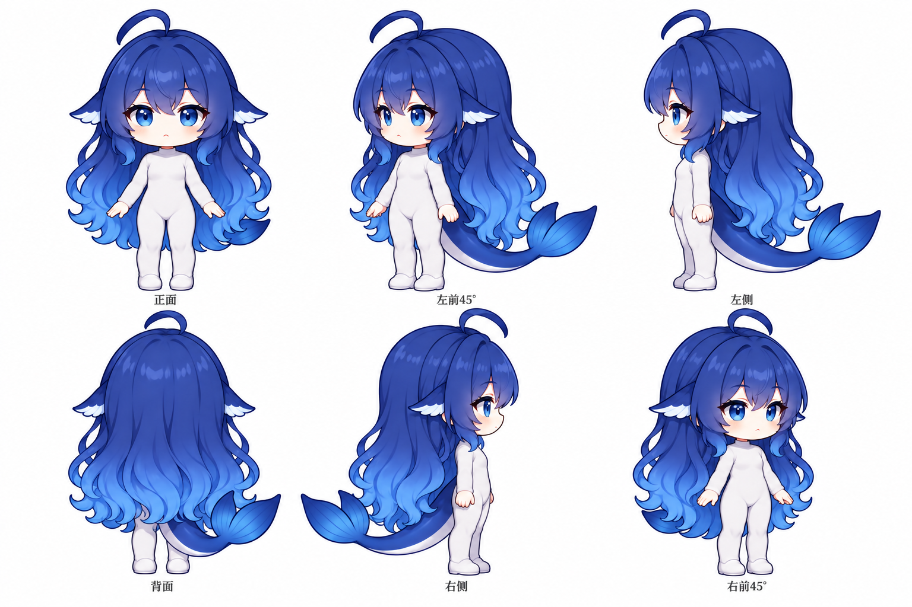
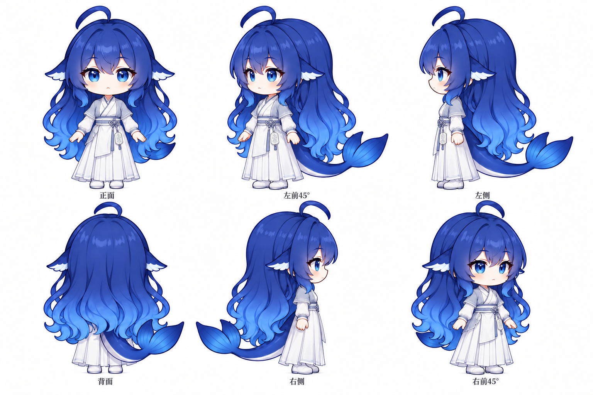

# DeepSeek 大肥鱼／鲸鱼娘 · 人物形象资源库

公开分享 DeepSeek 社区拟人形象“大肥鱼／鲸鱼娘”（“吃白饭的蓝色大肥鱼”）的改编设定图、基础六视图、古风服装与发型设定，方便非商业二创和角色参考。本仓库为个人非官方资源库。

**开放共享 · 允许非商业二创 · 不可商用 · 必须署名 · 二创同协议共享**

本仓库采用 **CC BY-NC-SA 4.0（知识共享「署名—非商业性使用—相同方式共享」4.0 国际版）**。这里的“开放共享”指美术资源的非商业开放授权。

## 当前内容

已收录 [DeepSeek 大肥鱼／鲸鱼娘 · 改编设定图](characters/whale-girl/README.md)：基础造型六视图、古风披发版、古风盘髻版及古风编发版，共 4 张原尺寸 PNG。

### 基础造型六视图

### 古风披发版六视图

### 古风盘髻版六视图

### 古风编发版六视图

角色资源放在 [`characters/`](characters/README.md)，每个角色使用独立文件夹，并附上角色名称、作者、图片来源与许可说明。可使用 [`角色说明模板`](templates/character.md) 填写。

## 当前角色的署名与来源

本组鲸鱼娘设定图结合下列角色、二次设计与 GitHub 设定图参考进行改编：

| 创作者 | 贡献 | 主页 |
| --- | --- | --- |
| 上善无形（上善） | 鲸鱼娘原始角色形象 | [Bilibili](https://space.bilibili.com/4456176) |
| ZipZipPipe | 加入 DeepSeek 元素的女仆鲸鱼娘二次设计 | [Bilibili](https://space.bilibili.com/4168597) · [Pixiv](https://www.pixiv.net/users/18604994) |
| YunYueSama | Q 版设定图参考与对应项目新增贡献 | [codex-deepseek-pet](https://github.com/YunYueSama/codex-deepseek-pet) · [设定图](https://github.com/YunYueSama/codex-deepseek-pet/blob/main/design/character-sheet.png) |
| xiaoweigen | 本组 AI 辅助改编、造型变体、设定图整理与发布 | [GitHub](https://github.com/xiaoweigen) |

使用本组图片时，请保留上述署名链。每张图片的改编说明见 [角色资源页](characters/whale-girl/README.md)，上游作品与公开许可来源见 [NOTICE.md](NOTICE.md)。本组改编贡献按 CC BY-NC-SA 4.0 发布，原始角色与前序设计的相关权利归相应创作者所有。

YunYueSama 的项目新增贡献按其自定义署名许可授权，使用时须保留作者与仓库地址。相关完整上游许可已随附于 [`licenses/`](licenses/README.md)。本组改编作品的非商业许可与各上游贡献的署名、许可保留义务一并适用。

## 使用规则

你可以在遵守协议的前提下，下载、保存、转载和分享资源，也可以修改、绘制二创、制作非商业表情包、壁纸或其他演绎作品。

使用及分享时须遵守：

1. **署名**：保留资源说明中的原作者、其他指定署名、来源链接、版权及许可信息，并标明是否修改过原作。署名应采用适合发布场景的合理方式。
2. **非商业使用**：不得以获取商业优势或金钱报酬为主要目的使用这些资源，例如销售素材或周边、用于商业广告，或作为付费产品与服务的商业卖点。本协议不授予商业使用许可；如需商用，须另行取得相关权利人的授权。
3. **相同方式共享**：公开发布基于这些资源创作的演绎作品时，须按 CC BY-NC-SA 4.0 或协议允许的兼容许可发布。建议统一采用 CC BY-NC-SA 4.0。
4. **保留后续使用权**：不得附加妨碍他人行使本协议所授予权利的法律限制或有效技术措施。

以上是便于阅读的摘要，具体权利和义务以 [完整许可正文](LICENSE) 为准。协议承认的合理使用等法定例外不受本声明限制。

## 署名示例

以下示例中的内容请替换为所用资源的真实信息；有多位创作者或前序二创时，应保留相应署名和修改记录。

> 《角色名称／作品名称》由「资源说明中列明的作者」创作，来源：原作品链接及 https://github.com/xiaoweigen/deepseek-dafeiyu-assets 。采用 CC BY-NC-SA 4.0，协议：https://creativecommons.org/licenses/by-nc-sa/4.0/ 。本次修改：无／具体修改说明。

## 版权与收录

仓库维护者：[xiaoweigen](https://github.com/xiaoweigen)。每份资源的作者和权利人以对应角色说明为准；上传者与创作者应分别标注。

除另有明确许可标注外，本仓库中由维护者或贡献者有权许可的人物设定图、相关美术资源及原创说明文档，均依 CC BY-NC-SA 4.0 发布。第三方资源须单独标明来源、作者、许可和适用范围，并遵守原有许可；本仓库不代第三方授予其未提供的权利。来源或授权不明确的素材不收录。

投稿时请附上对应角色说明，并确认有权按所标明的许可分享资源。涉及二创时，保留原作及前序创作者的署名链。版权或来源问题可通过 [GitHub Issues](https://github.com/xiaoweigen/deepseek-dafeiyu-assets/issues) 反馈。

## 许可文件

- [`LICENSE`](LICENSE)：未经修改的 CC BY-NC-SA 4.0 官方英文许可全文。
- [`LICENSE.zh-CN.md`](LICENSE.zh-CN.md)：本仓库的中文授权声明与使用摘要。
- [`NOTICE.md`](NOTICE.md)：已收录鲸鱼娘资源的署名链、上游来源与改编范围。
- [`licenses/`](licenses/README.md)：YunYueSama 的完整上游署名许可与素材范围说明。
- [官方中文协议说明](https://creativecommons.org/licenses/by-nc-sa/4.0/deed.zh-hans)。
- [官方中文法律文本](https://creativecommons.org/licenses/by-nc-sa/4.0/legalcode.zh-hans)。
