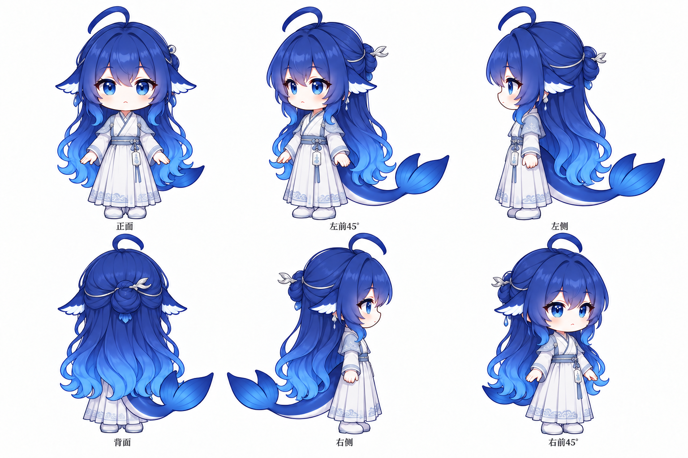
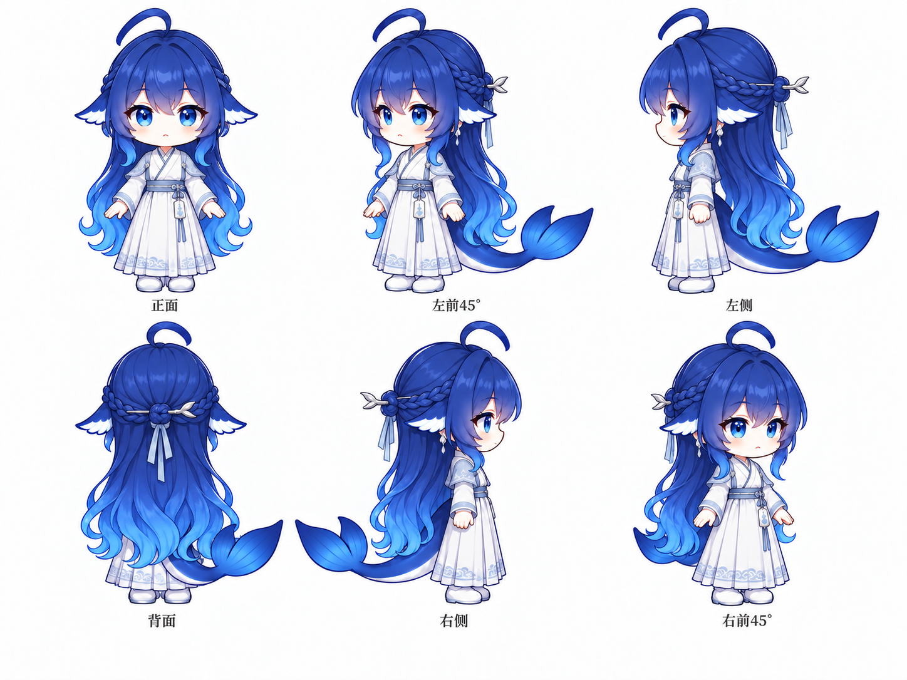
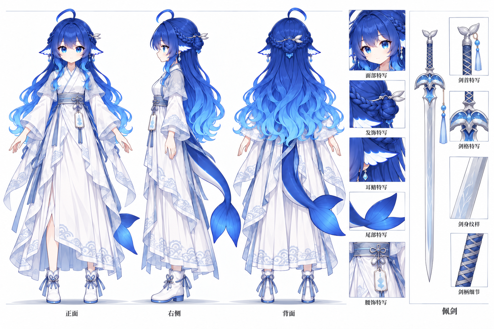
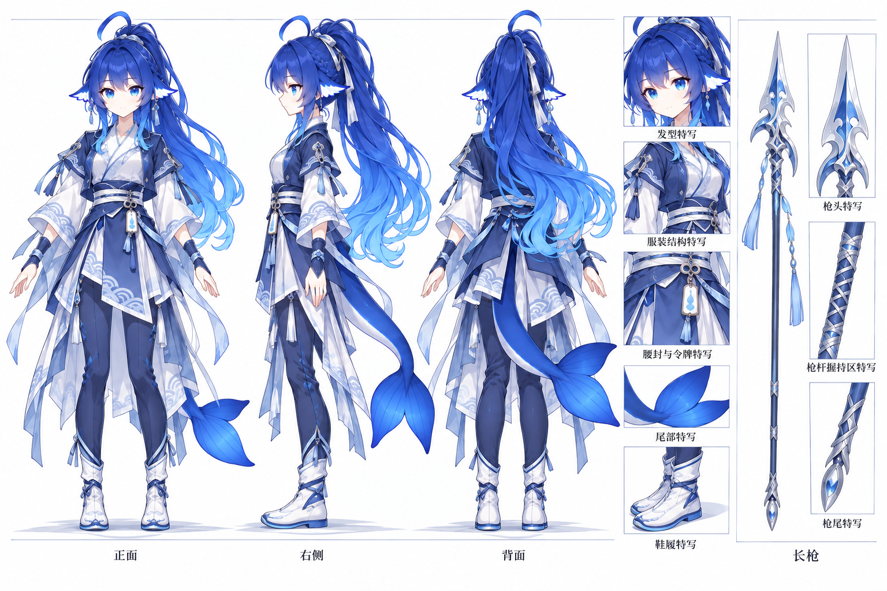

# DeepSeek 大肥鱼／鲸鱼娘 · 角色设定图

这套图是我结合上善无形的鲸鱼娘原始角色、ZipZipPipe 的 DeepSeek 女仆形象二次设计，以及 YunYueSama 的 Q 版设定图参考继续改编的作品。

这里有四套 Q 版基础与古风六视图，也有佩剑版、长枪版两套角色三视图及细节设定。希望能给大家的非商业二创提供一些参考。

**CC BY-NC-SA 4.0 · 署名 · 非商业使用 · 相同方式共享**

## 图片与尺寸

原图集中放在仓库最外层的 [images/](../../images/) 目录，点击图片或文件名即可查看。

| 图片 | 尺寸 | 内容 |
| --- | --- | --- |
| [基础造型六视图](../../images/base-six-views.png) | 1536 × 1024 | Q 版比例、蓝色长发和鲸尾，白色基础服装，正背面、左右侧及左右前 45° |
| [古风披发版六视图](../../images/hanfu-loose-hair-six-views.png) | 1536 × 1024 | 浅色古风长袍、交领、腰间挂饰与蓝色披发 |
| [古风盘髻版六视图](../../images/hanfu-bun-six-views.png) | 1536 × 1024 | 浅色古风长袍、后脑盘髻、银色发簪与头饰线 |
| [古风编发版六视图](../../images/hanfu-braided-six-views.png) | 1448 × 1086 | 浅色古风长袍、横向编发、后脑发结、银色发簪与浅青灰垂带 |
| [佩剑版设定图](../../images/hanfu-sword-design-sheet.png) | 1536 × 1024 | 古风裙装、编发盘髻、正侧背三视图，附面部、发饰、耳饰、鲸尾、腰饰与佩剑细节 |
| [长枪版设定图](../../images/hanfu-spear-design-sheet.png) | 1536 × 1024 | 古风战斗服装、高马尾、正侧背三视图，附发型、服装、腰饰、鲸尾、鞋履与长枪细节 |

| 基础造型六视图 | 古风披发版六视图 |
| :---: | :---: |
|  |  |

| 古风盘髻版六视图 | 古风编发版六视图 |
| :---: | :---: |
|  |  |

| 佩剑版设定图 | 长枪版设定图 |
| :---: | :---: |
|  |  |

## 创作来源

| 创作者 | 贡献 | 主页与作品 |
| --- | --- | --- |
| 上善无形（上善） | 鲸鱼娘原始角色形象 | [Bilibili](https://space.bilibili.com/4456176) |
| ZipZipPipe | DeepSeek 元素与女仆鲸鱼娘二次设计 | [Bilibili](https://space.bilibili.com/4168597) · [Pixiv《AI娘化》](https://www.pixiv.net/artworks/148186519) |
| YunYueSama | Q 版设定图参考与对应项目新增贡献 | [仓库](https://github.com/YunYueSama/codex-deepseek-pet) · [设定图](https://github.com/YunYueSama/codex-deepseek-pet/blob/main/design/character-sheet.png) |
| xiaoweigen | 本组 AI 辅助改编、造型变体与设定图整理 | [GitHub](https://github.com/xiaoweigen) |

这些图片使用 AI 辅助创作。上游角色和前序设计的相关权利归各自权利人所有，本组改编贡献按 CC BY-NC-SA 4.0 发布；具体来源与许可记录见 [NOTICE.md](../../NOTICE.md)。

## 原始文件记录

以下原图按内容命名，保留原始图片的内容、格式与分辨率。

| 仓库文件 | 原始文件名 |
| --- | --- |
| `base-six-views.png` | 2026年10月6日 23_57_12.png |
| `hanfu-loose-hair-six-views.png` | ChatGPT 图像 2026年10月7日 01_05_30.png |
| `hanfu-bun-six-views.png` | ChatGPT 图像 2026年10月7日 01_27_44.png |
| `hanfu-braided-six-views.png` | ChatGPT 图像 2026年10月7日 01_43_06.png |
| `hanfu-sword-design-sheet.png` | ChatGPT 图像 2026年10月7日 13_47_42.png |
| `hanfu-spear-design-sheet.png` | ChatGPT 图像 2026年10月7日 21_35_46.png |

## 使用与转载

欢迎在遵守 [CC BY-NC-SA 4.0](https://creativecommons.org/licenses/by-nc-sa/4.0/deed.zh-hans) 的前提下进行非商业分享和二创。公开分享时保留 **上善无形、ZipZipPipe、YunYueSama、xiaoweigen** 的署名、来源、许可信息及前序修改记录，说明自己的修改；演绎贡献按相同协议或协议允许的兼容许可发布。

YunYueSama 的署名须同时保留仓库地址 https://github.com/YunYueSama/codex-deepseek-pet ，其适用的完整上游许可保存在 [licenses/](../../licenses/README.md)。本协议不授予商业使用许可。

完整许可见 [LICENSE](../../LICENSE)，中文说明见 [LICENSE.zh-CN.md](../../LICENSE.zh-CN.md)，转载署名示例见 [仓库首页](../../README.md#使用与二创)。
